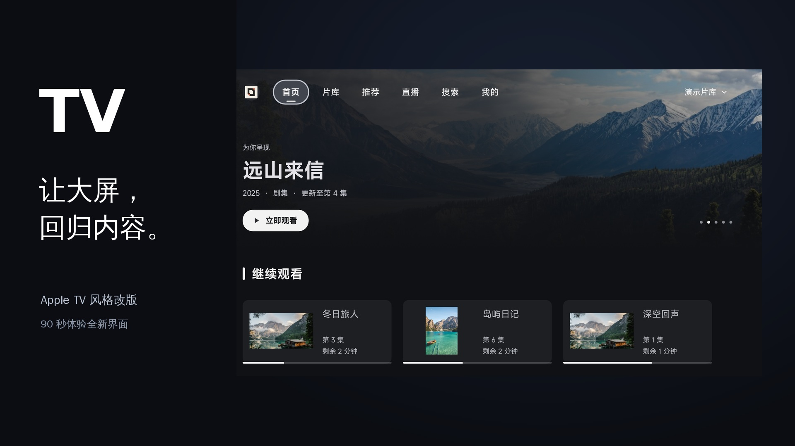
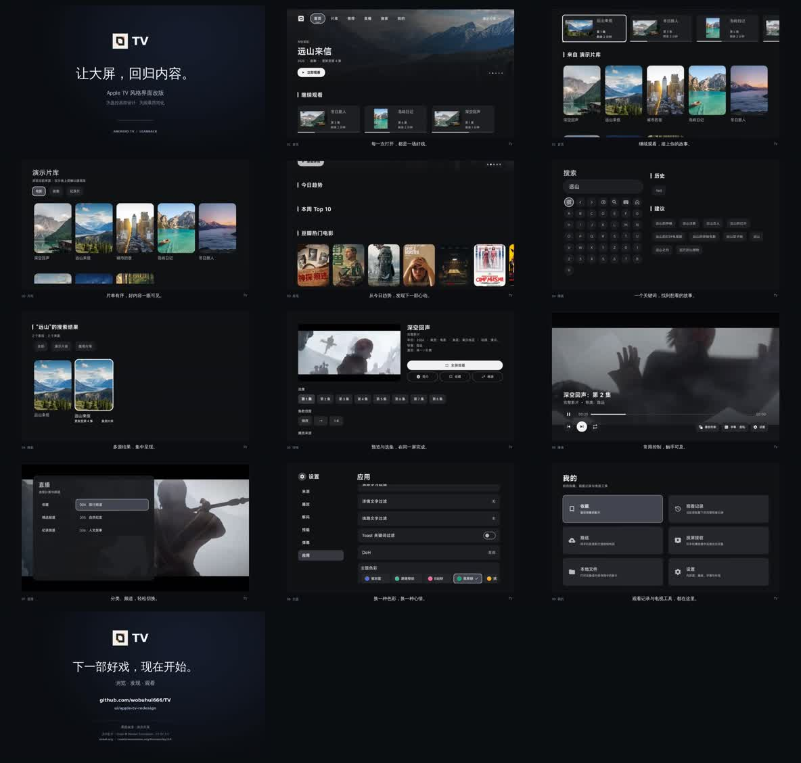

# TV · JetStream

**A media experience designed for the big screen and your remote.**

TV brings an Apple TV–inspired JetStream interface to Android TV, with a shared playback foundation for Android phones. Browse your library, resume a series, discover titles, and switch between live channels in one app.

[](docs/media/TV-promo.mp4)

[Download APKs](https://github.com/wobuhui666/TV/releases) · [Getting started](#getting-started) · [Playback core](docs/player-core-sync.md) · [Report an issue](https://github.com/wobuhui666/TV/issues) · [简体中文](README.md)

[Watch or download the video](docs/media/TV-promo.mp4) · 90 seconds · 1080p · H.264/AAC

The tour uses emulator recordings and a demonstration library. The displayed titles and sources are examples, not a supplied content service. See [media credits](docs/media/CREDITS.md) for footage, images, music, and fonts.

## At a glance

| Area | What you can do |
| --- | --- |
| TV interface | Navigate with a remote, use clear focus states, browse large artwork, and choose a theme color. |
| Library and search | Resume from history, manage favorites, browse categories, and search across configured sources. |
| Playback | Choose ExoPlayer/Media3 or MPV, with playback speed, aspect ratio, and subtitle controls. |
| Styled and dual subtitles | Render native ASS styles and animation, select primary and secondary subtitles independently, and import fonts. |
| Bitmap subtitles | Use SUP/PGS, embedded VobSub, and DVB subtitles on the documented playback paths. |
| Next episode | Let Exo prepare the next eligible episode with up to 10 seconds of preloaded media. |
| Audio | Adjust EQ, dialogue emphasis, loudness normalization, and limiting through audio profiles. |
| Extensions | Connect Python, JavaScript, or Java JAR spiders through external configuration. |
| Networking | Apply proxy routing rules and authentication, including handling across redirects. |

The current default branch is [`ui/apple-tv-redesign`](https://github.com/wobuhui666/TV/tree/ui/apple-tv-redesign). It includes the redesigned TV interface and the integrated playback core.

Published APKs may lag behind this source branch. Check the notes and source revision of the release you install: [`v421`](https://github.com/wobuhui666/TV/releases/tag/v421), for example, predates the playback core integration described here.

## A closer look

<details>
<summary>Open the interface overview</summary>



Frames from the finished promotional video, including the demonstration library and emulator UI.

</details>

The home screen puts featured artwork and continued viewing within reach. Library and discovery pages lead into search results, title details, and episode selection. Playback controls and settings use the same remote-friendly interaction patterns.

Live TV brings channel groups and channel selection together. The personal page provides entry points for favorites, history, media push, casting reception, local files, and settings.

## Getting started

### 1. Choose an APK

Open this repository's [Releases](https://github.com/wobuhui666/TV/releases) and read the release notes before downloading.

| Choice | Intended device |
| --- | --- |
| `leanback` / TV | Android TV, a TV box, or another device operated with a remote. |
| `mobile` | Android phones and touch devices, when that release provides a mobile APK. |
| `arm64-v8a` | A device with a 64-bit ARM Android environment. |
| `armeabi-v7a` | A device that requires a 32-bit ARM APK. |

Android 7.0 / API 24 is the minimum supported version. Match the APK to your device's Android ABI; a 64-bit processor alone does not guarantee a 64-bit Android environment.

### 2. Install and add your configuration

Install the selected APK on your device, then open **Settings → Sources** to add your own configuration URL or local file.

A configuration can define VOD sites, parsers, live channels, subtitles, danmaku, and network behavior. The app does not bundle a ready-to-watch media library or live TV subscription.

Start with [the configuration reference](docs/CONFIG.md). For live channels, see [supported live-source formats](docs/LIVE.md).

### 3. Make it yours

Choose a theme color, open a source, and browse or search for a title. During playback, use the subtitle and audio controls to select tracks and adjust presentation.

Exo's next-episode feature is controlled in **Settings → Preload**. It applies to eligible HTTP sources; parser-dependent, DRM, and non-HTTP sources are excluded. MPV retains its own current-stream cache.

## Playback details

The two playback engines share the app's browsing experience while retaining their own rendering and audio paths.

- **Exo / Media3:** native libass rendering for ASS, embedded font attachments, external ASS, and independent secondary subtitles.
- **MPV:** native subtitle rendering, secondary-track selection, font and style controls, and configurable playback options.
- **Subtitle formats:** text and bitmap coverage includes SRT, ASS, WebVTT, TTML, SUP/PGS, embedded VobSub, and DVB in the validated paths.
- **Audio profiles:** off, dialogue, night, music, and custom modes, with five EQ bands, multichannel center gain, normalization, and a limiter.
- **Continuity:** subtitle and audio changes preserve playback position and pause state; next-episode preloading is specific to Exo.

Audio processing may require PCM output instead of encoded passthrough. Subtitle containers, codecs, and device capabilities also affect the available path. The [playback core notes](docs/player-core-sync.md) describe supported cases and their boundaries, including VobSub container coverage.

## Configuration and integrations

Bring your own lawful sources and choose only the extensions you need.

| Guide | Use it for |
| --- | --- |
| [Configuration](docs/CONFIG.md) | VOD sites, parsers, live sources, network rules, subtitles, and danmaku settings. |
| [Spider API](docs/SPIDER.md) | Python, QuickJS JavaScript, and Java JAR integrations. |
| [Local API](docs/LOCAL.md) | Media push, playback controls, and subtitle or danmaku injection on your local network. |
| [Live formats](docs/LIVE.md) | M3U, TXT, JSON, channel groups, and live-source configuration. |

Forward Widget compatibility is limited to the supported adapter behavior; scripts that depend on unavailable host APIs may need changes. Use the configuration and Spider references when integrating a widget or another external script.

The mobile app can control compatible DLNA devices, and the TV app can receive casting requests. Availability depends on the receiving device, network, and media format.

## Build and contribute

Begin with [LOCAL_BUILD_ENV.md](LOCAL_BUILD_ENV.md) for the supported toolchain, local properties, signing setup, and Media3 source configuration.

A public [TV Codespace template](https://github.com/zhhshss/tv-codespace-template) is also available as a development starting point.

```bash
# Build a debug TV APK for ARM64.
./gradlew :app:assembleLeanbackArm64_v8aDebug

# Build a debug mobile APK for ARM64.
./gradlew :app:assembleMobileArm64_v8aDebug

# Run the app and proxy unit-test variants.
./gradlew :app:testLeanbackArm64_v8aDebugUnitTest :catvod:testDebugUnitTest
```

Shared application code lives in `app/src/main/`; TV and mobile interfaces live in `app/src/leanback/` and `app/src/mobile/`. The `catvod`, `quickjs`, and `chaquo` modules provide the extension foundations.

For a bug report, include the APK version or source commit, Android version, device ABI, playback engine, reproduction steps, and relevant logs. Remove credentials and private source URLs before posting to [Issues](https://github.com/wobuhui666/TV/issues).

## Validation

The [playback integration report](docs/player-core-sync.md) records the following completed checks on 2026-10-04:

| Check | Recorded result |
| --- | --- |
| App JUnit tests | 267 passed. |
| Proxy tests | 14 passed. |
| x86_64 Android emulator | 12 controlled playback scenarios passed. |
| ARM64 Android environment | 15 controlled scenarios passed, including native Python, MPV, and dual subtitles. |
| Builds | TV ARM64 and ARMv7 debug APKs built; mobile ARM64 Java/Kotlin compilation passed. |
| TV lint | 0 errors; 311 warnings remain. |

These runs cover controlled fixtures and the environments described in the report. They do not establish physical Samsung hardware, HDMI/HDR behavior, universal DRM support, or end-to-end AI recognition. Consult the linked evidence before applying those results to a different device or content source.

## Credits and license

This fork builds on [FongMi/TV](https://github.com/FongMi/TV) and [CatVod](https://github.com/CatVodTVOfficial/CatVodTVJarLoader), with thanks to their authors and the wider open-source community.

The project is distributed under [GNU GPL v3.0](LICENSE.md). Third-party components retain their own licenses and notices; see the attribution and reproducible-source information in [third_party/libass](third_party/libass) and [third_party/mpv](third_party/mpv).

Promotional footage includes **Sintel © Blender Foundation, CC BY 3.0**, demonstration photos from Unsplash, and a synthesized soundtrack. See [the complete media credits](docs/media/CREDITS.md).

TV is a media application, not a content provider. It does not supply media catalogs, subscriptions, or rights to third-party content. Add and use external sources only when you have the necessary permission.
