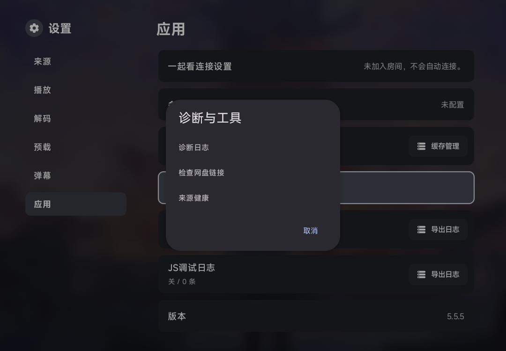
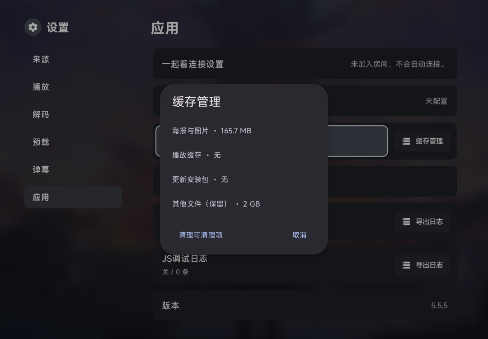

# 实用工具与播放资源治理验证

应用功能源码：`bb6dc639d3e86869958948e6ae8efa846aee9395`。设备验证版本：`86a628e12ee91e2f8b26b9cf39be33a2681e99c4`（只修正仪器测试启动服务的顺序）。交付前另修正不支持网盘平台时多余的标题分隔符，不涉及检测或播放逻辑。

## 自动检查

[完整 CI](https://github.com/wobuhui666/TV/actions/runs/37634916543) 两个 job 均成功：TV APK／instrumentation APK、手机端 Java 编译、catvod／QuickJS 测试、Python／JS 源兼容测试、OTA及新诊断／缓存／网盘／搜索健康／预缓存等定向单测。第一轮发现的 Android Intent.setClipData 返回 void 调用错误已修正；诊断分享不可变快照和 Python 会话隔离随后通过 CI。

## ARM64 设备

使用既有 Samsung SM-F900F 上的独立包 `com.fongmi.android.tv.preview`，没有替换正式包。安装前备份隔离包的偏好与数据库；CI 安装包校验 SHA-256 后使用既有测试签名重新签名，并逐条验证非签名内容与 CI 一致、检查 APK 对齐。传输时复用设备已装 APK 的相同 ZIP 数据块，重建后再次验证完整目标 APK SHA-256，安装的仍是完整的已校验 APK。

五项真实 instrumentation 测试通过，无跳过：

- 默认关闭不记录；开始后记录、故障快照、ZIP 内容及只清本模块文件。
- 真实 NanoHTTPD 下载：正确授权 200，错误／缺失授权拒绝，POST 拒绝，停止后旧授权拒绝。
- 1.5 倍速暂停状态在音频重建、连续重建及软硬解切换后保留。
- 下一集与当前片预载额度互斥、交接复用、关闭后取消。
- MPV 原生生命周期缓存保护，重复创建／释放不会错误释放第一代资源。

第一次 HTTP 测试曾在服务器启动前读取 Proxy.port=-1，导致错误判断无 LAN；修正测试前置顺序后上述五项全部通过，未用跳过替代验证。

## 界面与扫码

实机通过遥控方向键打开设置中的新入口；检查缓存分类和保留项、诊断操作、网盘不支持时的可继续播放提示，以及历史卡准确已播时间。

实际屏幕二维码用 ZXing 解码成功；通过设备端口转发验证停止记录后原二维码授权返回 404。截图没有包含诊断下载授权、配置地址或账户信息。

手机 variant 已编译，新增手势恢复策略有 JVM 回归；本轮实机运行的是 TV variant，并未把它称作手机 UI 的实测。私有备份、原始设备状态和安装包不纳入 Git。
