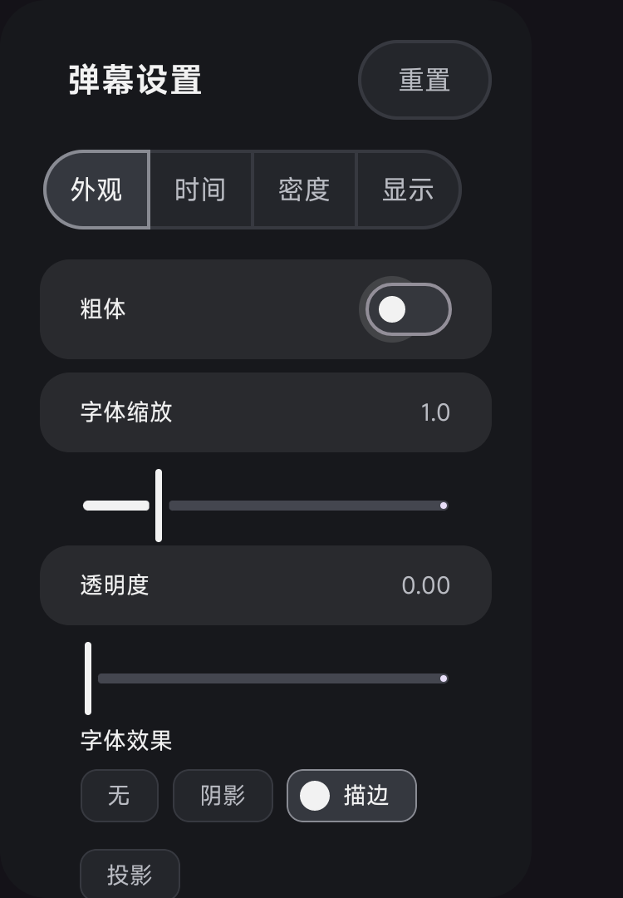
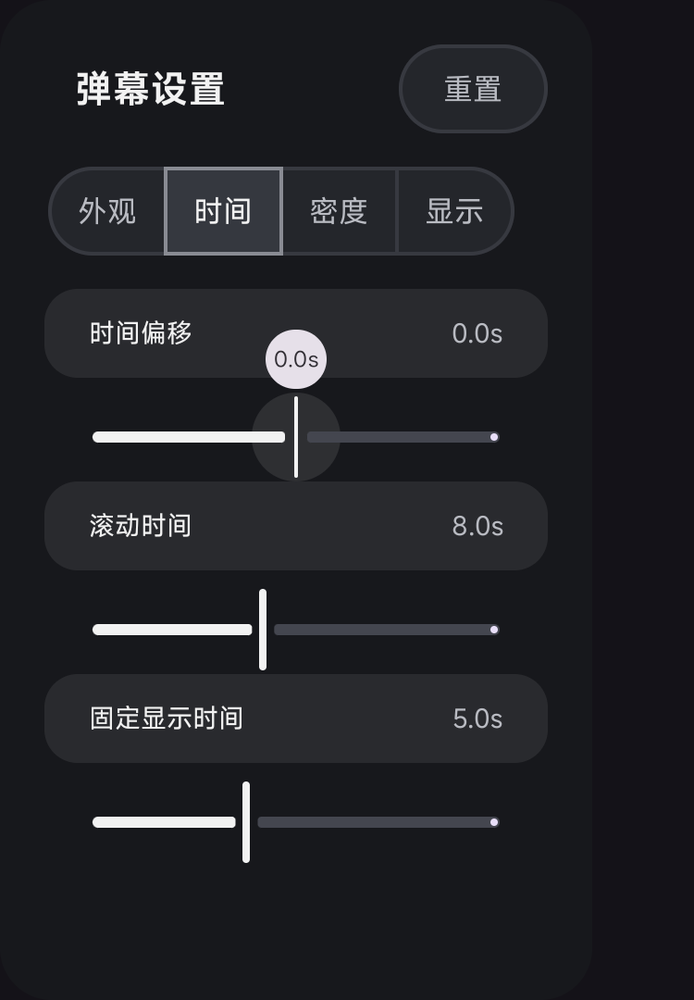
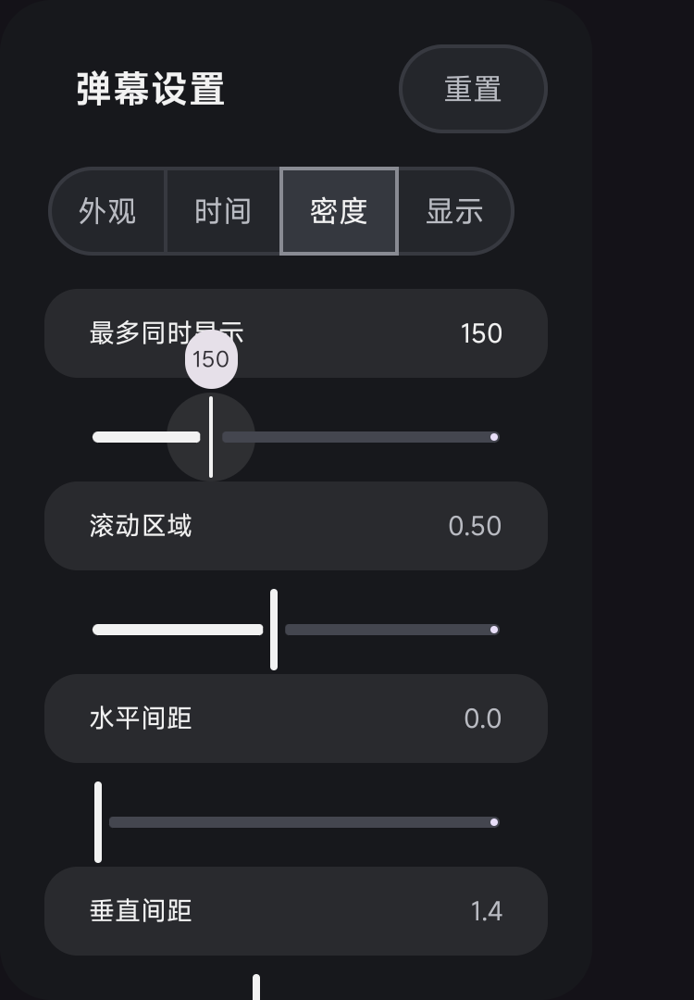
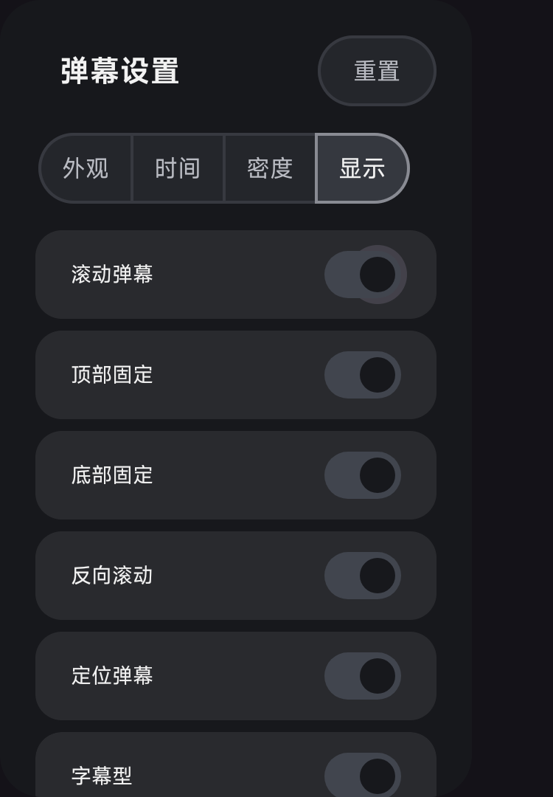

# 弹幕设置分类与焦点验证

2026-10-05：四个分类恢复为横向 MaterialButtonToggleGroup。默认 320dp 面板完整显示四项，280dp 窄面板按焦点横向滚动；内容单独纵向滚动，分类保持可见。按钮沿用 Material 绘制与 JetStream 配色，分类左右内边距为 16dp。

## 验证结果

- ARM64 debug app 与 androidTest 构建成功，最终增量构建耗时 47 秒。
- `DanmakuSettingFocusTest`：**2/2 通过，4.671 秒**。
- 四分类逐一执行真实方向键：左右切换、向下进入对应首项、向上回分类、经过重置按钮返回当前分类，以及左右边界。
- 默认宽度检查四个按钮全部可见；窄宽度检查横向滚入、长页面底部可达与返回、隐藏页面不会获取焦点。
- 测试宿主使用 debug 专用 `ComponentActivity`，支持面板 Compose 标题所需的生命周期；release 不包含测试宿主。

设备为 Tailscale 中的三星命名节点，报告型号 SM-F900F / Android 13 / ARM64，`ro.hardware=redroid`。本记录验证该 Android 环境的 UI 和方向键，不代表三星物理硬件测试。

更新的是 `com.fongmi.android.tv.preview` 预览包。原版应用保留，测试前备份的 6 份偏好设置已恢复，并逐文件核对 SHA-256 一致。APK 未加入仓库。

预览 APK SHA-256：`1e3b98dbb21a13ed9a8b2599211bdd3c17422d88ce0d8863391b69d9452f2e73`。

复现（已安装同签名的 app 与测试 APK）：

```bash
adb shell am instrument -w -r \
  -e class com.fongmi.android.tv.ui.dialog.DanmakuSettingFocusTest \
  com.fongmi.android.tv.preview.test/androidx.test.runner.AndroidJUnitRunner
```

## 设备截图

截图由 instrumentation 在每个分类向下进入首项后直接截取，面板宽度为 320dp，无播放源依赖。

| 外观 | 时间 |
| --- | --- |
|  |  |

| 密度 | 显示 |
| --- | --- |
|  |  |
