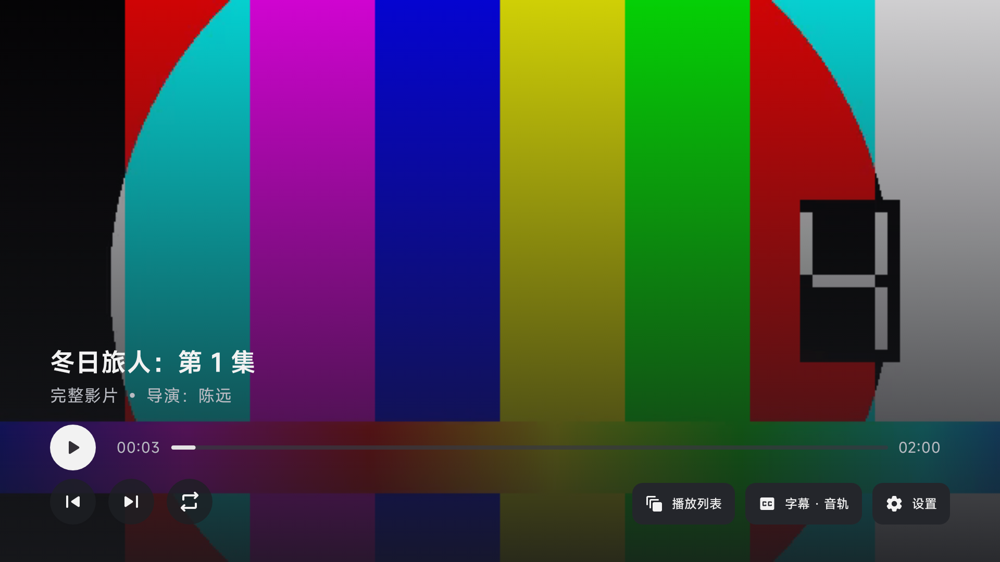
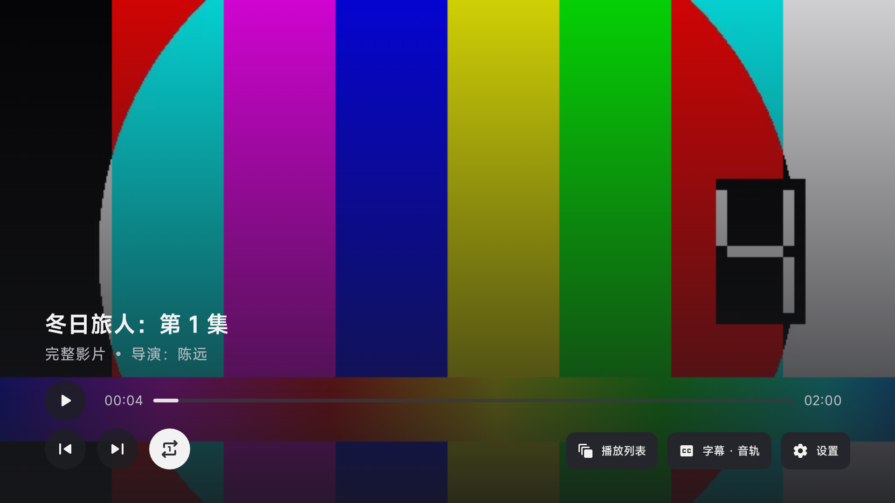

# 播放圆形按钮居中修复

播放/暂停、上集、下集、循环改为直接使用 AndroidX TV Material `IconButton` 与 `Icon`。此前普通文字按钮的内容行最小高度为 40dp，放入 44dp 圆形表面后，24dp 图标整体偏上 2dp。官方图标按钮会在整个表面内居中内容；按钮保持 44dp，保留官方形状与焦点配色，并映射应用调色板。

| 播放聚焦 | 循环聚焦并启用 |
| --- | --- |
|  |  |

API24、1920×1080、320dpi 模拟器的 UI 层级数据对比（偏移为图标中心减按钮中心）：

| 图标 | 修改前 X/Y（px） | 修改后 X/Y（px） |
| --- | --- | --- |
| 播放 | 0 / -4 | 0 / 0 |
| 上集 | 0 / -4 | 0 / 0 |
| 下集 | 0 / -4 | 0 / 0 |
| 循环 | 0 / -4 | 0 / 0 |

四个按钮分别聚焦时均完整显示。模拟器中已验证播放/暂停、上下集切换和循环开关；原有紧凑的进度提示间距保留。

ARM64 debug 构建、223 项单元测试通过；Lint 无错误（314 warning、6 hint），修改文件无 Lint 报告项。验证命令与环境见 [间距调整记录](README.md#验证)。截图使用虚构片库和仅供 UI 验证的 x86 包，本轮未在 ARM 真机安装测试。

原始 ARM64 debug APK SHA-256：

```text
6195c3ce9ee8066fe647e3b2f1e6a3851b91ad10d3e55fdc83db1489c46810a9
```
