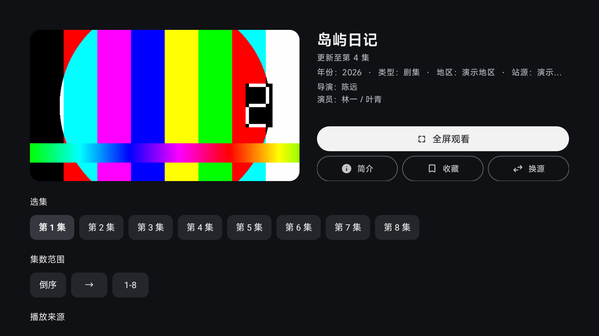
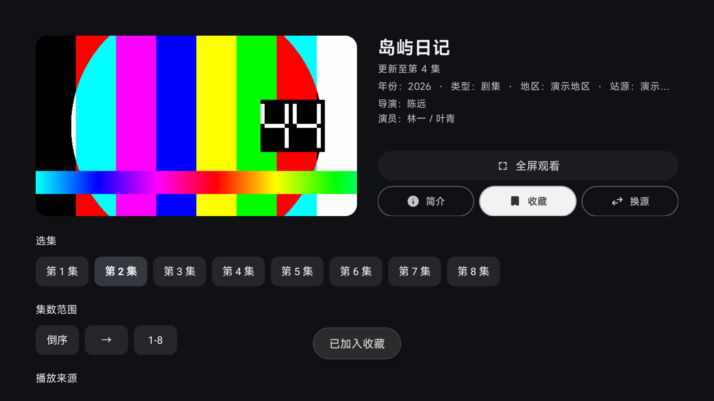
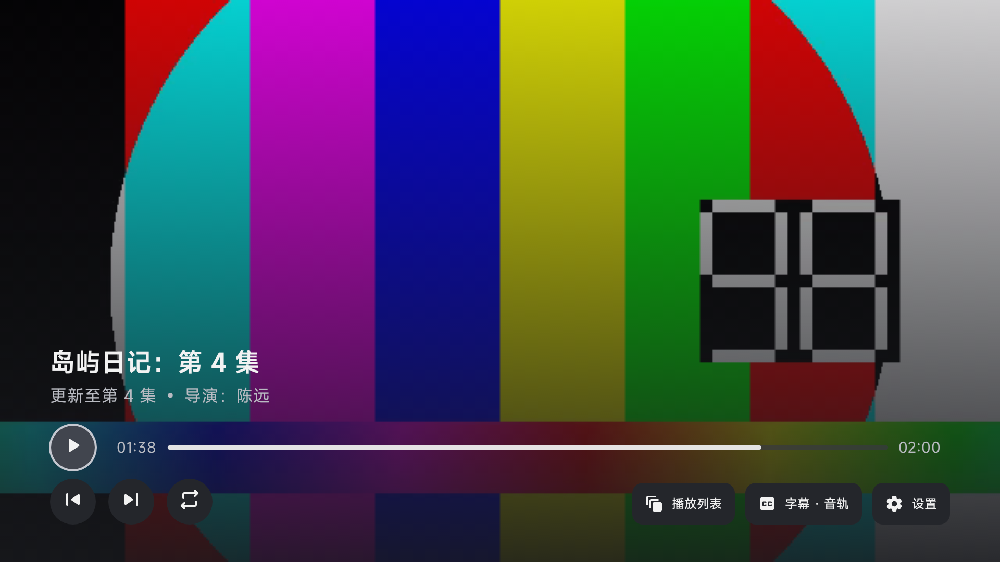
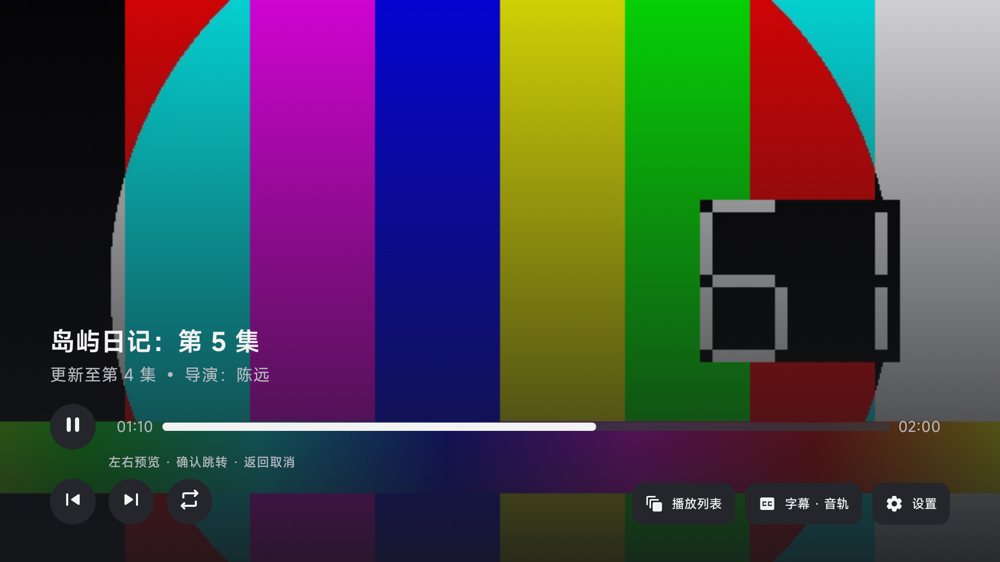

# 详情按钮与播放提示间距（2026-10-04）

详情页的“全屏观看”直接使用 AndroidX TV Material `Button`，简介、收藏、换源直接使用 `OutlinedButton`。保留官方胶囊形状、描边与焦点配色；应用调色板映射到 TV Material 主题，图标和文字居中。关闭聚焦放大，避免全宽按钮超出 View 宿主边界。

播放器不再为隐藏的快进提示保留 32dp 空行；进度区与下方操作区的间距从 14dp 收至 8dp，隐藏提示时总计减少 38dp。显示提示时仅留 4dp 顶部间距，文字按内容测量，保留完整的“左右预览 · 确认跳转 · 返回取消”。

| 全屏观看聚焦 | 收藏聚焦并选中 |
| --- | --- |
|  |  |

| 提示隐藏 | 快进预览提示显示 |
| --- | --- |
|  |  |

## 验证

在 Codespace 使用 JDK 21 与项目 SDK 兼容初始化脚本执行：

```sh
scripts/build-tv.sh :app:assembleLeanbackArm64_v8aDebug \
  :app:testLeanbackArm64_v8aDebugUnitTest \
  :app:lintLeanbackArm64_v8aDebug \
  --no-daemon --max-workers=2 --console=plain
```

构建成功；223 项单元测试全部通过；Lint 为 0 error、314 warning、6 hint，两份修改的 Kotlin 文件没有 Lint 报告项。

API24、1920×1080、320dpi 模拟器中使用方向键验证四个按钮聚焦、简介弹窗与返回、收藏加入与取消、向下进入选集，以及全屏退出恢复“全屏观看”焦点。快进预览从 00:38 移到 00:48，返回取消后恢复 00:38，确认后跳到 00:48；焦点移开会取消待定预览并收起提示。

截图使用模板的虚构片库和本地 H.264/AAC 样片。模拟器安装的是仅供 UI 验证的 x86 包，未在本轮覆盖验证真实 ARM 播放内核；换源按钮已验证聚焦与触发，但单站源 fixture 不覆盖跨站源切换。

原始 ARM64 debug APK（未提交到 Git）SHA-256：

```text
93e5ff1b5dc71b4a8b68f0aaaaf01983e9073ffb37da6c11ce5f7a40a19e794d
```
